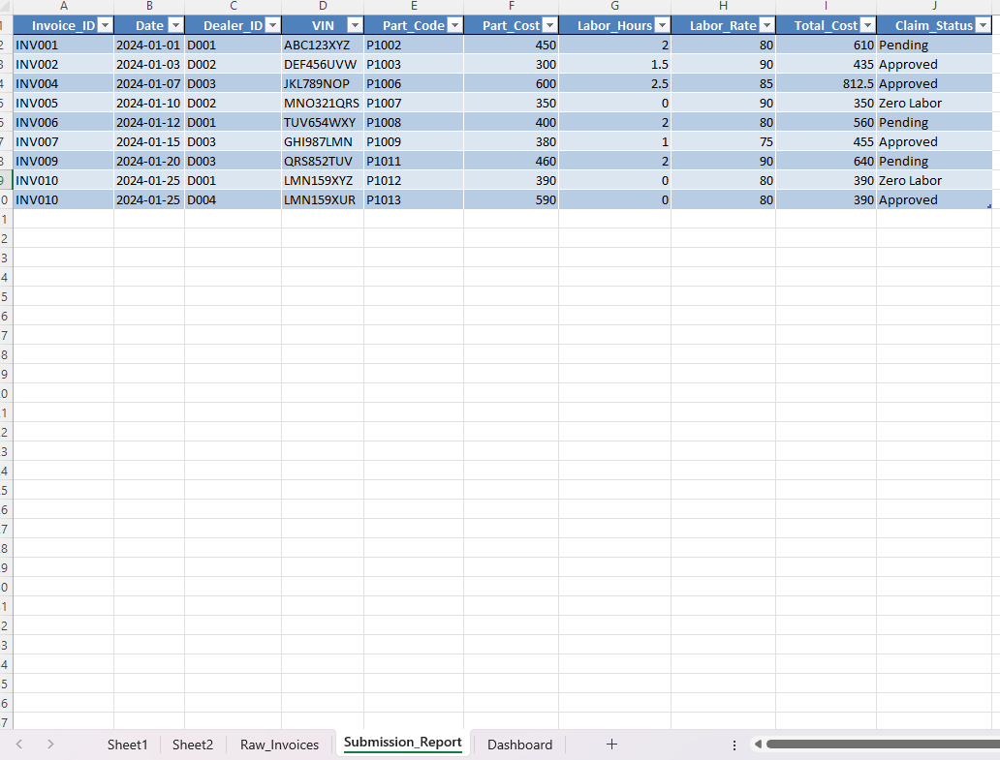

# seo-dashboard-tracker

## 🎯 Project Objective
This Excel VBA project simulates a real-world invoice reconciliation and reporting system. It automates billing validation, mismatch detection, and click-through exception tracking across 100+ transactions. The dashboard generates audit-ready reports and visual summaries using slicers and charts — designed for accounting, finance, and compliance support teams.

---

## ⚙️ Features
Automated validation macro to flag missing VINs or zero-cost transactions

Auto-transfer of valid claims to a clean Submission_Report sheet

Interactive Excel dashboard with:

Total Claims count

Approved vs Rejected breakdown

Total Payout Summary

Dealer-wise Bar Chart (Claim Volume)

Time-series Line Chart of Approved Claims

---

## 🧰 Tools Used
- Microsoft Excel
- Excel VBA (Form Controls, Loops, Logic)
- Pivot Tables and Charts

---

## 📸 Screenshots

## 🎥 Video Walkthrough

[Watch the Demo on Google Drive](https://drive.google.com/file/d/1fvKyAb23zy683c3xN65AajQzALXJAijp/view?usp=sharing)

---

## 📁 File
- Warranty_Claim_Automation.xlsm (macro-enabled workbook)
